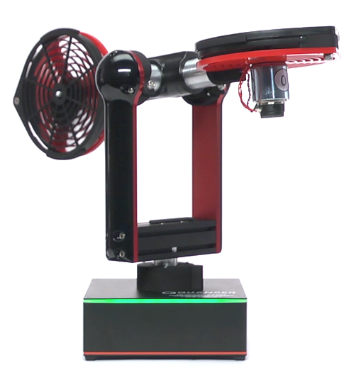

<h1>Quanser Aero Python</h1>

Python product application library for Quanser Aero 

## Overview

Quanser Aero is a learning tool developed and distributed by Quanser Consulting Inc.

 

This repository contains code for a Python interface to control Quanser Aero. 

## Contributing

You are very welcome to contribute to this project. Feel free to open an issue or pull request if you have any suggestions or bug reports.

[Quanser Aero documentation](https://docs.quanser.com/quarc/documentation/quanser_aero_usb.html)

## License

This project is licensed under the BSD 3-Clause License - see the `LICENSE` file for details. Note that the repository relies on third-party code, which is subject to their respective licenses.
